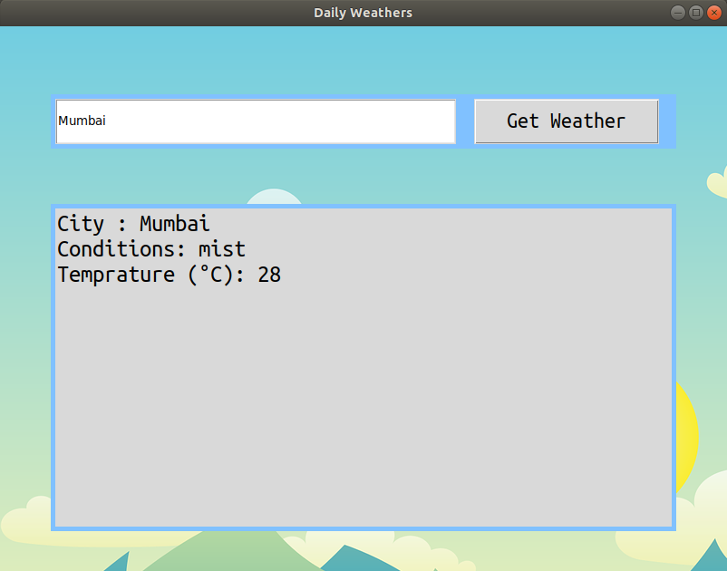

<<<<<<< HEAD

<!---To run in sublime , 1.ctrl+shift+p ,2.markdownpreview -broswer, 3.markdown--->

<h1>First Project 

<h3>Creating an Gui for displaying "Weather"

<h4>Tools:-
	
>1.Libraries:
	*requests*
	*tkinter*
>2.Api Knowledge(Basics)
>3.Json knowledge

<h4>References:-

>	1.[How to Program a GUI Application (with Python Tkinter)!](https://www.youtube.com/watch?v=D8-snVfekto&t=5s)

>	2.[TKinter Documentation](https://www.tutorialspoint.com/python/python_gui_programming.htm)

>	3.[What is API?](https://www.youtube.com/watch?v=tI8ijLpZaHk)

>	4.[Python Tutorial: Working with JSON Data using the json Module](https://www.youtube.com/watch?v=9N6a-VLBa2I)

>	5.[OpenWeatherMap:Current weather and forecast](https://home.openweathermap.org/api_keys)

<h4>Output :-

=======

<!---To run in sublime , 1.ctrl+shift+p ,2.markdownpreview -broswer, 3.markdown--->

<h1>First Project 

<h3>Creating an Gui for displaying "Weather"

<h4>Tools:-
	
>1.Libraries:
	*requests*
	*tkinter*
>2.Api Knowledge(Basics)
>3.Json knowledge

<h4>References:-

>	1.[How to Program a GUI Application (with Python Tkinter)!](https://www.youtube.com/watch?v=D8-snVfekto&t=5s)

>	2.[TKinter Documentation](https://www.tutorialspoint.com/python/python_gui_programming.htm)

>	3.[What is API?](https://www.youtube.com/watch?v=tI8ijLpZaHk)

>	4.[Python Tutorial: Working with JSON Data using the json Module](https://www.youtube.com/watch?v=9N6a-VLBa2I)

>	5.[OpenWeatherMap:Current weather and forecast](https://home.openweathermap.org/api_keys)

<h4>Output :-

>>>>>>> 826d842434e84e842a44bae2589ad6180cff7b86
